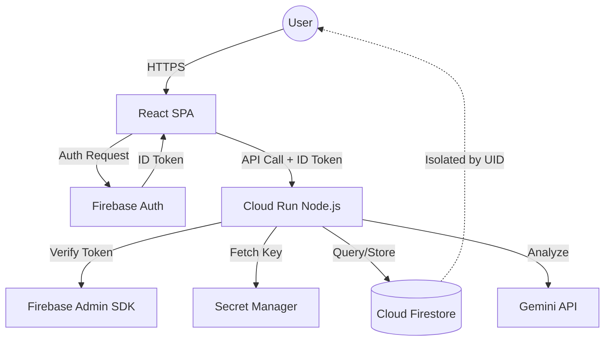

# MindVault AI - Production Architecture Document

## 1. System Architecture Overview
MindVault AI is built on a modern, secure, and scalable cloud-native architecture. It follows the principle of separation of concerns, ensuring that sensitive logic and secrets are handled exclusively on the server side.

### Components:
- **Frontend**: A React SPA built with Vite, TypeScript, and Tailwind CSS.
- **Backend**: A Node.js Express server written in TypeScript, hosted on Google Cloud Run.
- **Authentication**: Firebase Authentication for identity management.
- **Database**: Cloud Firestore for scalable, noSQL document storage.
- **Secret Management**: Google Cloud Secret Manager for handling API keys and credentials.
- **AI Service**: Gemini API for advanced natural language processing and journaling insights.

## 2. Frontend Architecture
- **Framework**: React 18+
- **State Management**: React Context API (for Auth) and Hooks.
- **Routing**: React Router for protected and public routes.
- **Styling**: Tailwind CSS for a modern, responsive UI.
- **Icons**: Lucide React.
- **API Client**: Axios or Fetch with interceptors for attaching Firebase ID tokens.

## 3. Backend Architecture
- **Framework**: Express.js with TypeScript.
- **Security Middleware**: 
  - `helmet`: Secure HTTP headers.
  - `cors`: Restricted to authorized origins.
  - `express-rate-limit`: Prevents abuse of AI endpoints.
- **Services**:
  - `AuthService`: Verifies Firebase ID tokens.
  - `GeminiService`: Interacts with Google AI SDK.
  - `FirestoreService`: Handles isolated data operations.
  - `SecretService`: Fetches secrets from Google Cloud Secret Manager.

## 4. Firebase Authentication Flow
1. User signs in via Google or Email/Password on the React frontend.
2. Firebase Client SDK manages the session and provides a JWT (ID Token).
3. The frontend persists the auth state using Firebase's `onAuthStateChanged`.
4. For every API request to the backend, the ID token is refreshed (if needed) and sent in the `Authorization: Bearer <token>` header.

## 5. Firebase ID Token Verification Flow
1. Backend receives the request.
2. `authMiddleware` extracts the Bearer token.
3. `admin.auth().verifyIdToken(token)` is called to validate the signature and expiration.
4. The verified `uid` and user claims are attached to the `request` object (`req.user`).
5. If verification fails, a `401 Unauthorized` response is returned.

## 6. Gemini Request Flow
1. Backend receives an authenticated request (e.g., `/api/chat`).
2. Backend retrieves the `GEMINI_API_KEY` from Google Cloud Secret Manager (cached in memory for performance).
3. Backend constructs a prompt, including conversation history if applicable.
4. Backend calls the Gemini API via the `@google/generative-ai` SDK.
5. Response is processed, stored in Firestore (isolated by `uid`), and returned to the client.

## 7. Secret Manager Flow
- **Environment**: Backend runs on Cloud Run.
- **Identity**: Cloud Run Service Account is granted the `Secret Manager Secret Accessor` role.
- **Access**: Backend uses the Secret Manager API to fetch secrets at startup or on-demand.
- **Security**: No secrets are stored in `.env` files in production or committed to Git.

## 8. Firestore Data Model
Data is structured to ensure absolute isolation.
```
/users/{uid}
    /profile (doc)
    /journalEntries/{journalId} (collection)
        - title, content, mood, topics[], summary, createdAt
    /conversations/{conversationId} (collection)
        - title, messages[], updatedAt
    /insights/{insightId} (collection)
        - type, data, generatedAt
    /weeklyReflections/{reflectionId} (collection)
        - weekStarting, summary, metrics, suggestions
```

## 9. Firestore Security Model
Strict rules enforce that users can only read/write their own data.
```javascript
service cloud.firestore {
  match /databases/{database}/documents {
    match /users/{userId}/{document=**} {
      allow read, write: if request.auth != null && request.auth.uid == userId;
    }
  }
}
```

## 10. API Endpoint Architecture
- `POST /api/chat`: Multi-turn chat with Gemini.
- `GET /api/conversations`: List user conversations.
- `POST /api/journals/analyze`: Trigger AI analysis for a journal entry.
- `GET /api/insights`: Fetch generated growth patterns.
- `POST /api/weekly-reflection`: Generate/fetch weekly summary.

## 11. Personal Growth Timeline Architecture
- **Aggregation**: Backend queries `journalEntries` and `conversations` for the authenticated `uid`.
- **Analysis**: Gemini analyzes the aggregated text to find patterns (mood trends, recurring topics).
- **Visualization**: Frontend renders a Chronological Timeline using the structured data.

## 12. Weekly Reflection Architecture
- **Trigger**: User requests a reflection for a specific date range.
- **Processing**: Backend fetches data for that range, sends it to Gemini with a "Weekly Summary" system prompt.
- **Storage**: The resulting JSON is stored in the `weeklyReflections` subcollection for future reference.

## 13. Threat Model & Mitigations
| Threat | Impact | Mitigation |
|--------|--------|------------|
| Unauthorized API Access | High | Firebase ID Token verification on every request. |
| Cross-user Data Access | Critical | Firestore Security Rules + Backend UID derivation. |
| Gemini API Key Leakage | Critical | Google Cloud Secret Manager + Server-side only calls. |
| Prompt Injection | Medium | Strict system instructions and input sanitization. |
| Denial of Service (AI) | High | Rate limiting per user and global request caps. |

## 14. OWASP Security Considerations
- **Broken Access Control**: Enforced via Firestore Rules and Backend middleware.
- **Cryptographic Failures**: All traffic over HTTPS; secrets managed by Secret Manager.
- **Injection**: Input validation using `zod` or `joi` on the backend.
- **Vulnerable Components**: Regular dependency audits and automated updates.

## 15. Cloud Run Deployment Architecture
- **Containerization**: Multi-stage Docker build for Node.js.
- **Scaling**: Auto-scaling based on CPU/Request count.
- **VPC Connector**: (Optional) For secure internal resource access.
- **Ingress**: Restricted to HTTPS.

## 16. IAM Permissions Required
- `roles/secretmanager.secretAccessor`: For the Cloud Run Service Account.
- `roles/datastore.user`: For Firestore access.
- `roles/logging.logWriter`: For structured logging.

## 17. Data Flow Diagram (Mermaid)


## 18. Trust Boundaries
- **Client/Server Boundary**: The frontend is untrusted. All validation happens on the backend.
- **Identity Boundary**: Firebase Auth provides the source of truth for identity.
- **AI Boundary**: Gemini output is treated as untrusted and validated before storage.

## 19. Attack Surfaces
- Public API endpoints.
- Firebase Auth Login/Signup forms.
- Journal content input (XSS).
- Chat interface (Prompt injection).

## 20. Security Controls
- **Rate Limiting**: Applied at the API level.
- **Audit Logs**: Cloud Logging tracks all sensitive operations.
- **Validation**: Strict schema validation for all incoming payloads.
- **Isolation**: Per-user subcollections in Firestore.
